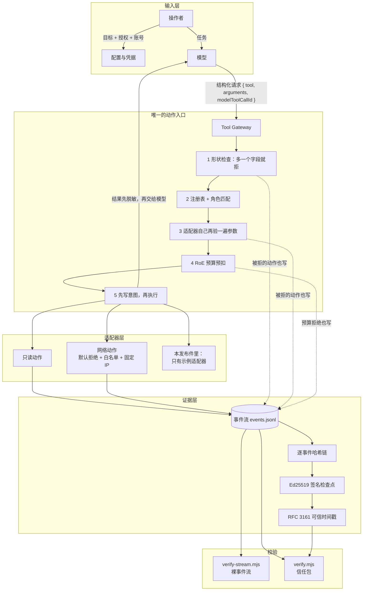
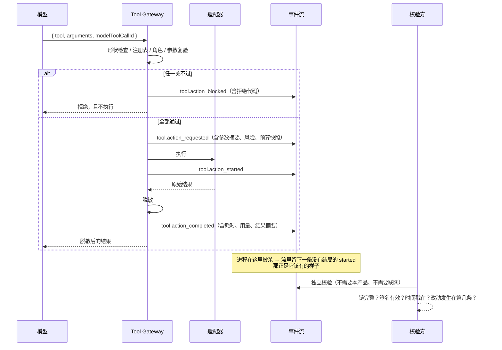

# 核心架构

这份文档说明这套东西**是怎么组织的**，以及为什么这样组织。
读完它应当能回答一个问题：模型想做一件事，到这件事真的发生，中间必须过几道关、留下什么记录。

## 1. 一页图



## 2. 四道闸门

「默认拒绝」不是一句口号，它是四条各自独立、都必须过的检查：

| 闸门 | 拦什么 | 在哪一层 |
| --- | --- | --- |
| **网络出口** | 目标不在白名单、重定向、证书异常、端口不符 | 出网客户端（唯一出口） |
| **会话 scope** | 本次会话没被授权访问那个 origin | 会话授权层 |
| **工具与参数** | 工具没注册、当前角色不允许、参数超出各自的白名单 | Tool Gateway + 适配器 |
| **RoE 预算** | 请求数超了本会话上限、速率超了每分钟上限 | Tool Gateway（执行前预扣） |

为什么要分四道而不是合成一道：**它们的失效方式不同**。白名单解决「能不能到那儿」，
scope 解决「这一次允许不允许」，工具参数解决「用哪个动作、带什么参数」，
预算解决「打多少次」。合成一道检查，任何一处放松都会连带放松其它三处。

## 3. 一次动作的完整生命周期



关键顺序是 `requested → started → completed`：**效果发生之前，意图必须已经落盘**。
被拒绝的动作同样写事件 —— 一份只记录「成功」的日志，无法回答「它到底试过什么」。

## 4. 证据层的三个层次，各自能证明什么

| 层 | 机制 | 证明了什么 | **不能**证明什么 |
| --- | --- | --- | --- |
| L1 | 逐事件前序哈希链 | 内容自写入以来没被改动、删除或插入 | 这些记录是什么时候写的（本机时钟可改） |
| L2 | Ed25519 签名检查点 | 这段历史由持有对应私钥的一方签署过 | 签署者**是谁**。默认密钥与事件流同处一个工作区 |
| L3 | RFC 3161 可信时间戳 | 这些记录在某个第三方时刻已经存在 | 内容对不对。它只证时间，不证真伪 |

这三句话里的每一句都刻意写得比产品手册窄。**说大了就是自毁**：
一个声称「能证明是谁签的」而实际上密钥就在同一个目录里的系统，在第一次安全审计时就会失去全部信用。
要跨组织抵赖，唯一可行的做法是把公钥**带外**固定（当面、电话、纸质件），
再用 `--pubkey` / `--expect-signing-key` 校验 —— 那也是整条链里唯一无法由包自己证明的环节。

## 5. 事件流的位置与「只有一个事实来源」

```
<工作区>/
  events.jsonl          单一事实来源。只追加。
  events.jsonl.lock     写锁（存在即代表有进程持锁）
  context.json          可重建投影（删掉不影响任何校验）
  audit-key.pem         本机签名私钥（**不要**随证据一起交出去）
```

投影与历史会话都**不是**第二条事实来源：它们由事件流重建，删掉不影响任何校验结论。
一条链对应一个工作区 —— 多个工作区共用同一条流，链会互相污染。

## 6. 这份发布件包含什么、不包含什么

**包含**（举证与审计那一半）：

- 事件流的读写与格式（`src/event-log.mjs`、`src/event-codec.mjs`）
- 稳定序列化（`src/canonical.mjs`）——哈希链的基础
- 哈希链、签名检查点、创世锚点（`src/audit-chain.mjs`）
- 零依赖的 RFC 3161 客户端（`src/timestamp.mjs`）——DER/CMS 自己解，不引第三方库
- 脱敏实现（`src/redact.mjs`）——值、结构、分片三个层面
- Tool Gateway 的**骨架**（`src/gateway.mjs`，配示例适配器）与 RoE 预算（`src/budget.mjs`）
- 两个校验入口（`tools/verify.mjs`、`tools/verify-stream.mjs`）

**不包含**（攻击面那一半，刻意留在闭源侧）：

- 任何能直接对真实目标发起批量请求的脚本、模板、字典或扫描器适配器；
- Prompt 模板（角色提示词）；
- 完整的攻击链编排逻辑（侦察 → 枚举 → 验证的编排器）；
- 技能方法论库。

这不是「忘了开源」，是**设计**：一份能证明自己做过什么、却不能被直接拿去打别人系统的工具，
才是可以放在公开仓库里的东西。

## 7. 为什么事件流要用哈希链，而不是「写个日志 + 定期备份」

日志回答「发生了什么」，哈希链回答「这份记录有没有被动过」。差别在三种场景里是决定性的：

1. **事后被改**：有人删掉对自己不利的那几条。删一条，后面每一条的 `prev` 都对不上。
2. **事后补写**：有人想证明「我早就测过了」。L3 的时间戳由外部机构签发，本机时钟改不掉它。
3. **整份替换**：有人拿另一台机器的流换掉这一份。这需要带外公钥固定，本地怎么查都查不出来 ——
   所以文档里从不声称能防住它。
